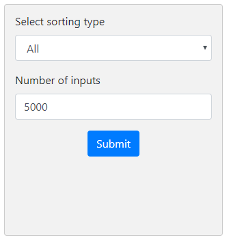
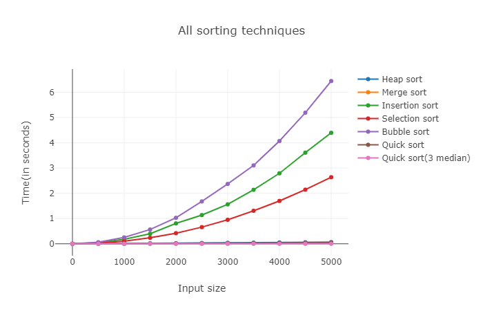
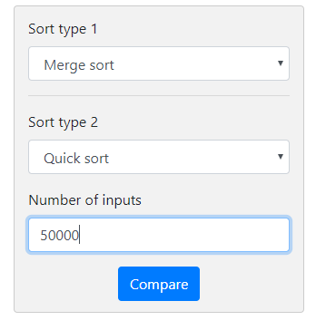
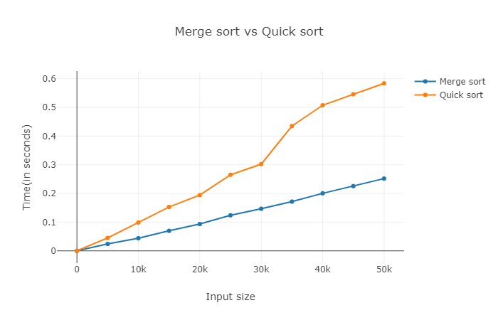

# Comparison of sorting algorithms

I have created a basic website to show the time complexity of various graphs with respect to input size. For the front-end development, I have used HTML, CSS and JavaScript while for backend development, I have used Python and Flask. This website has forms for comparison between 2 algorithms or between all algorithms. Example of forms:

 
 the output will be
 
 
 
 
 
The second form consists of comparison between two sorting types. The form also provides an input for the length of array. 

 the output will be
 
 
 
